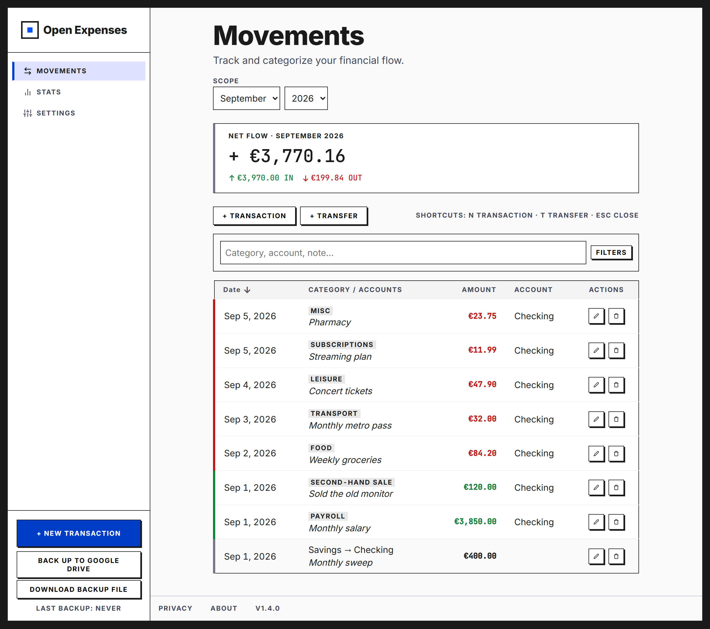
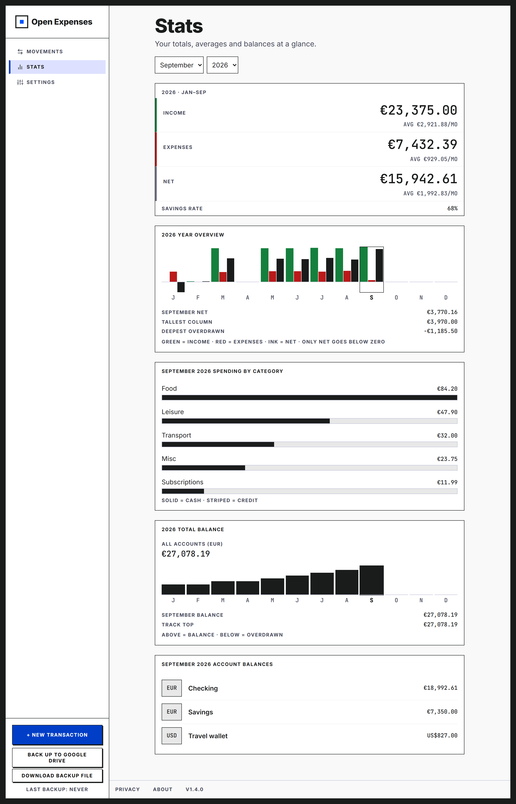

  

  
  
  

**Tu dinero. Tu navegador. Tu registro.**

Open Expenses es un controlador de gastos personales que reemplaza la hoja de cálculo. Funciona por completo en tu navegador como PWA, guarda cada cifra en tu dispositivo y ofrece una única copia de seguridad opcional en tu propio Google Drive. Sin cuenta, sin servidor, sin rastreo. Software libre bajo AGPL-3.0.

## Pruébala

Abre **[openexpenses.app](https://openexpenses.app/landing)**. Nada que instalar: la app alojada es la build de producción de este repo, funciona sin conexión una vez cargada y se actualiza sola mediante el service worker, con un aviso dentro de la app cuando hay una versión nueva lista.

## Origen

Open Expenses empezó como una plantilla de Google Sheets, afinada a mano durante diez años de presupuestos reales. Mes a mes enseñó una lección: un registro es una disciplina, no una base de datos. En 2026 la plantilla se convirtió en esta app: el mismo registro, reconstruido para funcionar por completo en tu navegador.

## Lo que ofrece

- **LOCAL-FIRST.** Cada cifra vive en tu navegador (IndexedDB). La app funciona del todo sin conexión.
- **SIN CUENTA. SIN SERVIDOR. SIN RASTREO.** No hay backend: tus datos salen de tu dispositivo solo cuando tú haces una copia.
- **MULTIDIVISA.** Cuentas en distintas monedas; los tipos de cambio vienen del Banco Central Europeo (vía Frankfurter) y puedes confirmarlos o corregirlos en cada movimiento.
- **LAS TRANSFERENCIAS SON OTRA COSA.** Las transferencias entre tus propias cuentas nunca cuentan como ingreso ni gasto, y las de divisa cruzada guardan el tipo de cambio que usaron.
- **ESTADÍSTICAS CON INTENCIÓN.** Totales del año hasta el periodo, promedios mensuales, tasa de ahorro, gastos por categoría y saldos por cuenta al cierre del periodo elegido.
- **COPIA EN TU PROPIO DRIVE.** Una acción manual guarda `open-expenses-backup.json` en tu Google Drive; restaurarla en otro dispositivo es un paso.
- **INGLÉS Y ESPAÑOL.** Toda la app, y este README también.

## Capturas

**Movimientos**, el registro:

  

**Estadísticas**, el resumen:

  

## Construida con

Angular 21, TypeScript, Dexie sobre IndexedDB y las tipografías Inter y JetBrains Mono autoalojadas. Cada decisión de arquitectura está escrita en [docs/adr/](docs/adr/).

**AUTOALOJAMIENTO.** Es un sitio estático: clona el repo, ejecuta `npm ci` y `npm run build`, y sirve `dist/open-expenses/browser` en cualquier host estático. La producción corre en Cloudflare Pages; GitHub Pages sirve como alternativa.

## Apóyame

Si Open Expenses te ahorra los dolores de cabeza de una hoja de cálculo, puedes invitarme a un café:

  

## Licencia

Open Expenses es software libre bajo [AGPL-3.0](LICENSE).
